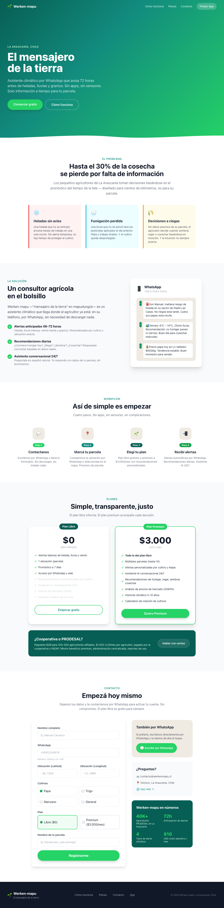
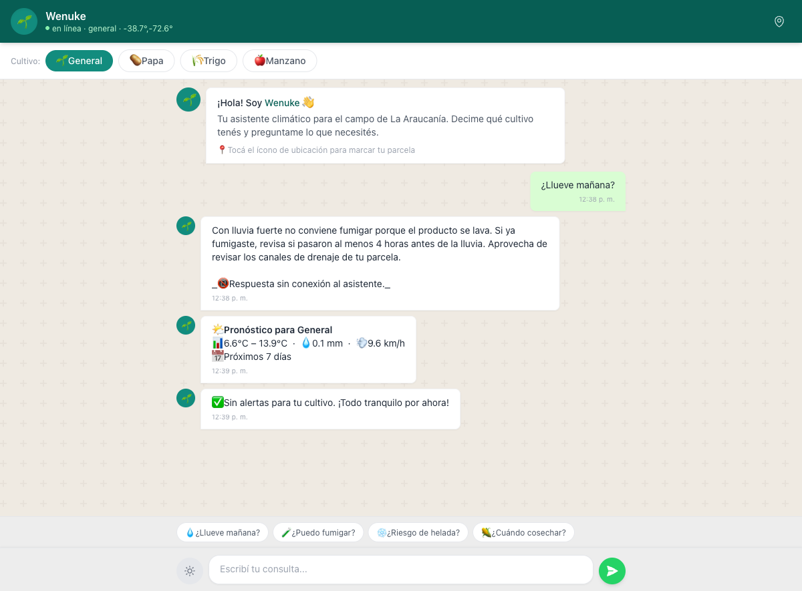

# Werken-mapu — El mensajero de la tierra

> Asistente climático agrícola por WhatsApp para pequeños agricultores de La Araucanía, Chile.
> Alertas anticipadas 48–72h, recomendaciones diarias y asistente IA conversacional.

[](https://frontend-lac-eight-97.vercel.app)
[](https://backend-beryl-nu-18.vercel.app)
[](https://github.com/sebitabravo/Wenuke/actions/workflows/test.yml)
[](./LICENSE)
[](https://python.org)
[](https://fastapi.tiangolo.com)

## Demo en vivo

| Entorno | URL |
|---|---|
| **Landing page** | [frontend-lac-eight-97.vercel.app](https://frontend-lac-eight-97.vercel.app) |
| **Demo chat** | [frontend-lac-eight-97.vercel.app/app](https://frontend-lac-eight-97.vercel.app/app) |
| **API Docs** | [backend-beryl-nu-18.vercel.app/docs](https://backend-beryl-nu-18.vercel.app/docs) |

### Capturas

| Landing | Chat demo |
|---|---|
|  |  |

| Selección de cultivo | Recomendación IA |
|---|---|
|  |  |

---

## El problema

Los pequeños agricultores de La Araucanía pierden hasta el **30% de su producción anual** por decisiones basadas en pronósticos climáticos genéricos, diseñados para centros urbanos a cientos de kilómetros de sus parcelas.

- Una helada sin aviso destruye meses de trabajo en una noche
- Una lluvia no prevista lava la fumigación del día anterior
- Un día seco no aprovechado retrasa la siembra semanas

**Raíz del problema:** la brecha entre los datos climáticos disponibles (gratuitos, globales) y el conocimiento agronómico local que convierte esos datos en decisiones accionables.

## La solución

Werken-mapu ("mensajero de la tierra" en mapudungún) automatiza esa traducción. El agricultor comparte su ubicación, elige sus cultivos, y recibe alertas y recomendaciones directamente en WhatsApp — sin instalar nada, sin aprender nada nuevo.

```
Agricultor → WhatsApp → comparte ubicación → elige cultivos → recibe alertas y recomendaciones
```

**Principios de diseño:**
1. **Cero fricción.** El agricultor ya usa WhatsApp. Ahí mismo recibe el valor.
2. **Dominio primero.** Las reglas agronómicas son el core. El software es el delivery mechanism.
3. **Offline-capable.** Sin API key de IA, el sistema responde con conocimiento experto pre-cargado.
4. **Costo mínimo.** APIs gratuitas siempre que exista alternativa viable. $0/mes operativos sin WhatsApp Business.

---

## Arquitectura

```
┌──────────────────────────────────────────────────────────┐
│                    CLIENTES                               │
│  WhatsApp (prod)  │  Navegador web (demo/landing)         │
│  Meta Business API│  Vanilla JS · Leaflet · Tailwind CDN  │
└────────┬──────────┴───────────────┬──────────────────────┘
         │ HTTPS                    │ HTTPS
┌────────▼──────────────────────────▼──────────────────────┐
│                   FASTAPI (Vercel Serverless)             │
│                                                           │
│  ┌─────────────────────────────────────────────────────┐ │
│  │  Routes (main.py) — 14 endpoints                     │ │
│  │  /clima  /preguntar  /recomendaciones  /historico   │ │
│  │  /precios  /registrar  /parcelas CRUD  /plan CRUD   │ │
│  │  /enviar-alertas (admin)                             │ │
│  └──────────┬──────────────┬───────────────────────────┘ │
│             │              │                              │
│  ┌──────────▼────┐  ┌──────▼──────────┐                  │
│  │  Domain Layer │  │  External APIs  │                  │
│  │  (zero I/O)   │  │  (async HTTP)   │                  │
│  │               │  │                 │                  │
│  │  reglas.py    │  │  clima.py       │                  │
│  │  Motor de     │  │  OpenMeteo      │                  │
│  │  reglas por   │  │  forecast +     │                  │
│  │  cultivo      │  │  archive (gratis│                  │
│  │  19 umbrales  │  │  sin API key)   │                  │
│  │  por cultivo  │  │                 │                  │
│  └───────────────┘  │  llm.py         │                  │
│                     │  Groq Llama 3.1  │                  │
│                     │  + fallback      │                  │
│                     │  offline con     │                  │
│                     │  reglas expertas │                  │
│                     │                 │                  │
│                     │  odepa.py        │                  │
│                     │  Precios mercado │                  │
│                     │  + referencia    │                  │
│                     │                 │                  │
│                     │  whatsapp.py     │                  │
│                     │  Meta Graph API  │                  │
│                     │  v21.0           │                  │
│                     └─────────────────┘                  │
│                                                           │
│  ┌─────────────────────────────────────────────────────┐ │
│  │  Data Layer (db.py) — Dual backend                   │ │
│  │  ┌──────────────────┐  ┌──────────────────────────┐ │ │
│  │  │ Turso (HTTP)     │  │ aiosqlite (local)         │ │ │
│  │  │ libsql-experiment│  │ WAL mode · FK enabled     │ │ │
│  │  │ Serverless prod  │  │ Desarrollo local          │ │ │
│  │  └──────────────────┘  └──────────────────────────┘ │ │
│  │  Interfaz unificada: fetchall fetchone execute insert│ │
│  └─────────────────────────────────────────────────────┘ │
│                                                           │
│  ┌─────────────────────────────────────────────────────┐ │
│  │  Background (scheduler.py)                           │ │
│  │  asyncio loop cada 6h → evalúa reglas → WhatsApp    │ │
│  └─────────────────────────────────────────────────────┘ │
└──────────────────────────────────────────────────────────┘
```

### Stack tecnológico

| Capa | Tecnología | Decisión |
|---|---|---|
| **API** | FastAPI 0.115 (Python 3.12) | Tipado fuerte, async nativo, validación Pydantic v2, OpenAPI auto-generado |
| **Base de datos** | Turso + aiosqlite (dual) | Turso: SQLite sobre HTTP, serverless, $0 free tier. aiosqlite: mismo schema para dev local |
| **Clima** | OpenMeteo API | Gratis, sin API key, cobertura global, forecast horario + archivo histórico |
| **IA** | Groq (Llama 3.1 70B) + fallback offline | $0.59/M tokens. Sin key → responde con reglas expertas pre-cargadas |
| **Precios** | ODEPA datos de referencia | Mercado mayorista chileno (Lo Valledor). Scraping planeado, no implementado en MVP |
| **Mensajería** | WhatsApp Business Cloud API | Meta Graph API v21.0. Envío directo, sin proveedor intermediario |
| **Mapas** | Leaflet + OpenStreetMap | Open source, sin API key, tiles gratuitos |
| **Frontend** | HTML5 + Tailwind CSS CDN + Vanilla JS | Cero build step, cero dependencias npm, carga instantánea |
| **CI/CD** | GitHub Actions → Vercel | Ruff + mypy + pytest. Deploy automático desde main |
| **Infra** | Vercel (Static + Serverless) | HTTPS, CDN global, deploy desde monorepo con rootDirectory por proyecto |

**Costo operativo estimado: $0–10 USD/mes** (vs $200+ con APIs comerciales equivalentes).

### Estructura del proyecto

```
Wenuke/
├── frontend/                    # Vercel Static
│   ├── index.html               # Landing page — diseño WhatsApp-inspired
│   ├── app.html                 # Demo chat — interfaz mobile-first
│   ├── app.js                   # Lógica del chat (vanilla JS, 274 LOC)
│   └── vercel.json
├── backend/                     # Vercel Serverless (Python)
│   ├── main.py                  # FastAPI app — 14 endpoints, lifespan, CORS
│   ├── models.py                # Schemas Pydantic v2 — 17 modelos con validaciones chilenas
│   ├── reglas.py                # Motor de reglas por cultivo — dominio puro, cero I/O (442 LOC)
│   ├── clima.py                 # Cliente OpenMeteo — forecast + histórico + cache espacial
│   ├── llm.py                   # Cliente Groq + fallback offline con reglas expertas
│   ├── odepa.py                 # Precios mayoristas — referencia + scraping (pendiente)
│   ├── whatsapp.py              # WhatsApp Business API — envío directo, formato E.164
│   ├── servicio_alertas.py      # Lógica compartida API/scheduler — dispatch de alertas
│   ├── scheduler.py             # Loop asyncio cada 6h para chequeo automático
│   ├── db.py                    # Dual backend Turso/aiosqlite — interfaz unificada (470 LOC)
│   ├── config.py                # Configuración tipada desde variables de entorno
│   ├── .env.example             # Variables de entorno de referencia
│   ├── requirements.txt
│   ├── vercel.json
│   └── tests/
│       ├── e2e/
│       │   ├── test_e2e_api.py       # 9 tests httpx contra prod
│       │   └── test_e2e_playwright.py # 13 tests browser contra prod
│       └── test_*.py                  # Tests unitarios (reglas, clima)
├── docs/
│   ├── screenshots/              # Capturas de pantalla
│   ├── pitch.pdf                 # Deck de presentación
│   └── pitch-2.pdf               # Deck complementario
├── DESIGN.md                    # Design system (Stitch/awesome-design-md)
├── CONTRIBUTING.md              # Guía de contribución
└── .github/workflows/test.yml   # CI: ruff + mypy + pytest
```

---

## API

### Endpoints

| Método | Ruta | Auth | Descripción |
|---|---|---|---|
| `GET` | `/` | — | Health check (servicio, versión, estado, modo offline) |
| `GET` | `/clima` | — | Pronóstico 7 días + alertas por cultivo y coordenadas |
| `POST` | `/preguntar` | — | Asistente IA conversacional con contexto climático real |
| `GET` | `/recomendaciones` | — | Recomendaciones diarias: fumigar, regar, sembrar, cosechar |
| `GET` | `/historico` | — | Datos climáticos históricos 1–10 años (OpenMeteo Archive) |
| `GET` | `/precios` | — | Precios mayoristas de referencia por producto |
| `POST` | `/registrar` | — | Alta de agricultor — retorna token de autenticación |
| `GET` | `/parcelas` | Bearer | Listar parcelas del usuario autenticado |
| `POST` | `/parcelas` | Bearer | Agregar parcela nueva (validación plan free/premium) |
| `DELETE` | `/parcelas/{id}` | Bearer | Eliminar parcela (valida ownership) |
| `GET` | `/plan` | Bearer | Ver plan actual y uso de parcelas |
| `POST` | `/plan` | Bearer | Cambiar plan (free ↔ premium) |
| `POST` | `/refresh-token` | Bearer | Rotar token de autenticación |
| `POST` | `/enviar-alertas` | Admin Bearer | Dispatch manual de alertas vía WhatsApp |

### Autenticación

- **Usuarios:** `Authorization: Bearer <token>` — token generado en `/registrar`, almacenado como hash SHA-256 en BD. Expira a los 90 días. Usar `/refresh-token` para rotar.
- **Admin:** `Authorization: Bearer <admin_token>` — configurado via `ADMIN_TOKEN` env var. Sin valor configurado (mínimo 16 caracteres), el endpoint retorna 501.

### Modelo de datos

```
usuarios ──< parcelas ──< cultivos
    │
    └──< alertas_enviadas (auditoría)
```

- **usuarios:** id, whatsapp (UNIQUE), nombre, plan (free|premium), token (UNIQUE)
- **parcelas:** id, usuario_id (FK), nombre, lat, lon
- **cultivos:** id, parcela_id (FK), tipo (papa|trigo|manzano|general)
- **alertas_enviadas:** id, usuario_id (FK), tipo, mensaje, timestamp

---

## Setup local

```bash
# 1. Clonar
git clone https://github.com/sebitabravo/Wenuke.git
cd Wenuke

# 2. Backend
cd backend
python3 -m venv .venv && source .venv/bin/activate
pip install -r requirements.txt

# Variables de entorno (opcionales — el sistema funciona sin ellas)
# GROQ_API_KEY     → IA conversacional (sin key = modo offline con reglas expertas)
# WHATSAPP_TOKEN   → Envío de alertas por WhatsApp
# TURSO_DATABASE_URL + TURSO_AUTH_TOKEN → BD serverless (sin esto = SQLite local)
cp .env.example .env  # editar solo si tenés las keys

uvicorn main:app --reload --port 8000

# 3. Frontend (otra terminal)
cd frontend
python3 -m http.server 3000
# → Landing: http://localhost:3000
# → Demo:   http://localhost:3000/app
```

### Variables de entorno

| Variable | Requerida | Default | Descripción |
|---|---|---|---|
| `GROQ_API_KEY` | No | (vacío) | API key de Groq. Sin ella, responde offline con reglas expertas |
| `WHATSAPP_TOKEN` | No | (vacío) | Token de WhatsApp Business Cloud API |
| `WHATSAPP_PHONE_NUMBER_ID` | No | (vacío) | Phone Number ID de WhatsApp |
| `ADMIN_TOKEN` | **Sí** (prod) | (vacío) | Token para `/enviar-alertas`. Mínimo 16 chars. Sin valor → 501 |
| `TURSO_DATABASE_URL` | No | (vacío) | URL de Turso. Sin ella, usa SQLite local |
| `TURSO_AUTH_TOKEN` | No | (vacío) | Auth token de Turso |
| `DB_PATH` | No | `wenuke.db` | Path del archivo SQLite local |
| `FORECAST_DAYS` | No | `7` | Días de pronóstico a consultar |
| `CACHE_TTL_SEGUNDOS` | No | `1800` | TTL del cache de clima (30 min) |
| `CORS_ORIGINS` | No | `localhost:3000,...` | Orígenes CORS permitidos (separados por coma) |

---

## Decisiones técnicas

### ¿Por qué FastAPI y no Django/Flask?

FastAPI da validación automática vía Pydantic, documentación OpenAPI sin configuración extra, y soporte async nativo — crítico para un sistema que consulta 3 APIs externas por request. Django era sobre-ingeniería para 14 endpoints. Flask requería demasiado boilerplate para validación.

### ¿Por qué Turso + aiosqlite y no PostgreSQL?

SQLite es la base de datos más usada del mundo. Turso la expone sobre HTTP con replicación global, ideal para serverless (Vercel Functions no mantienen conexiones persistentes). aiosqlite permite desarrollo local sin depender de servicios externos. El dual backend abstrae la diferencia: mismo schema, misma interfaz, cero cambios de código entre entornos.

PostgreSQL para este caso de uso (MVP, usuarios <1000) habría sido costo y complejidad innecesarios.

### ¿Por qué Llama 3.1 70B vía Groq y no GPT-4o?

Costo. Groq cobra $0.59/M tokens vs $5+ de OpenAI. Para un sistema que podría procesar cientos de consultas diarias de agricultores, la diferencia es significativa. Además, el fallback offline con reglas expertas hardcodeadas asegura que el sistema nunca deje de responder — ni siquiera sin conexión a internet.

### ¿Por qué Vanilla JS y no React/Vue?

El chat demo es una SPA de una sola pantalla. React habría agregado ~40KB de JS para un componente que son 274 líneas de vanilla. La landing page es estática. No hay estado complejo que justifique un framework. Tailwind CDN evita build step.

Para un producto real con múltiples pantallas y lógica de suscripción, React con Next.js sería la elección correcta — pero para MVP de hackathon, vanilla JS es la decisión consciente.


### Cobertura de tests

El motor de reglas (`reglas.py`, 442 LOC, dominio puro) tiene **20+ tests unitarios** cubriendo severidades de helada/lluvia/viento/granizo, detección de alertas por cultivo, y generación de recomendaciones (fumigar/regar/sembrar/cosechar). Cliente de clima con tests de parseo y cache. API con tests E2E (`httpx` + `playwright`). CI corre ruff + mypy + pytest en cada push.

---

## Recursos

- [Demo en vivo](https://frontend-lac-eight-97.vercel.app)
- [API Docs (OpenAPI)](https://backend-beryl-nu-18.vercel.app/docs)
- [Design System](./DESIGN.md)
- [Pitch Deck (PDF)](./docs/pitch.pdf)

## Licencia

MIT © 2026 Werken-mapu
