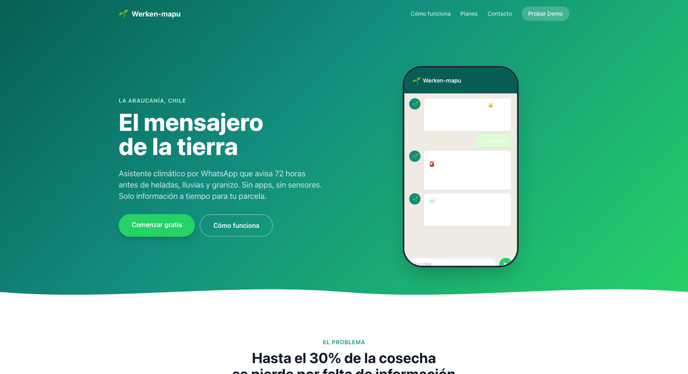
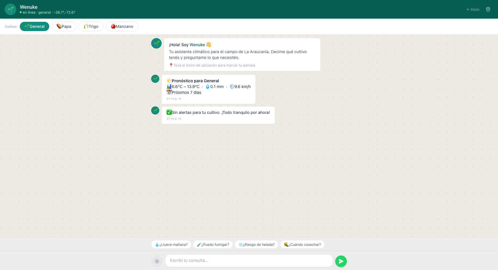
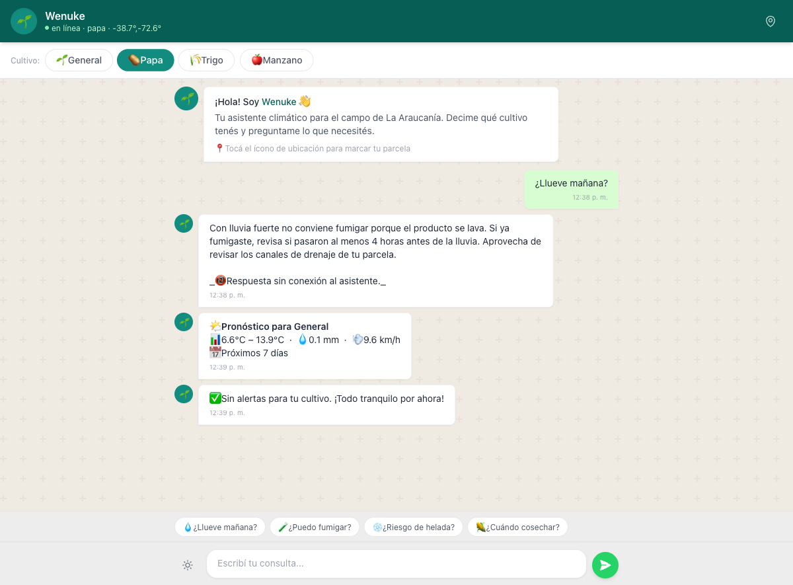
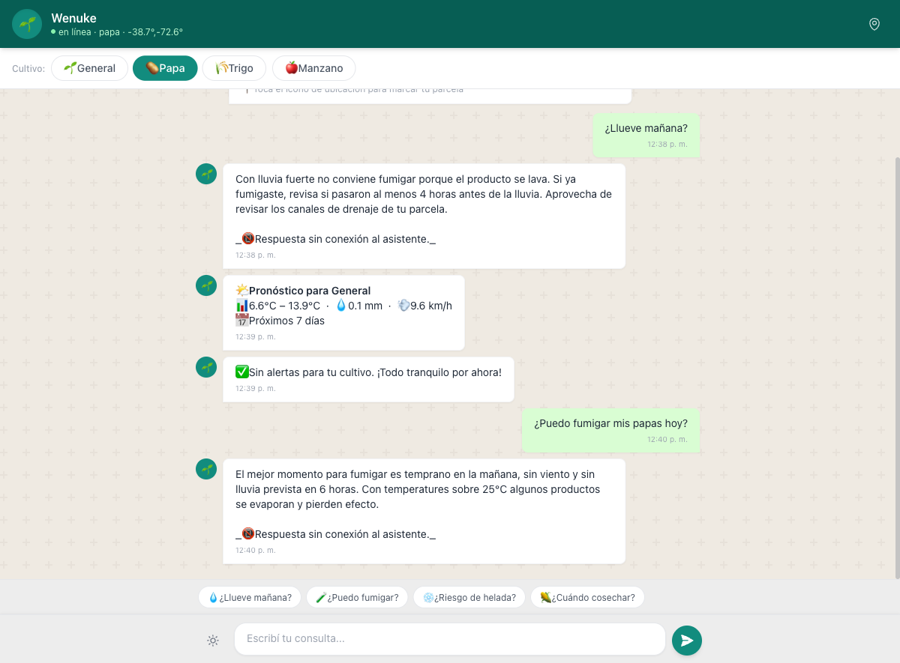

# Werken-mapu — El mensajero de la tierra

> Asistente climático agrícola por WhatsApp para pequeños agricultores de La Araucanía, Chile.
> Alertas anticipadas, recomendaciones por cultivo e IA conversacional. Sin apps, sin sensores.

## Demo

| Entorno | URL |
|---|---|
| Landing | [frontend-lac-eight-97.vercel.app](https://frontend-lac-eight-97.vercel.app) |
| Chat demo | [frontend-lac-eight-97.vercel.app/app](https://frontend-lac-eight-97.vercel.app/app) |
| API docs | [backend-beryl-nu-18.vercel.app/docs](https://backend-beryl-nu-18.vercel.app/docs) |

<table>
<tr>
  <td></td>
  <td></td>
</tr>
<tr>
  <td></td>
  <td></td>
</tr>
</table>

## El problema

Pequeños agricultores pierden hasta el **30% de su producción anual** por decidir con pronósticos climáticos genéricos hechos para ciudades, no para sus parcelas. Una helada sin aviso destruye meses de trabajo en una noche.

## La solución

Werken-mapu ("mensajero de la tierra" en mapudungún) llega donde el agricultor ya está: **WhatsApp**. Comparte ubicación, elige cultivos, recibe alertas y recomendaciones accionables. Sin instalar nada.

**Costo operativo: $0–10 USD/mes.** Sin APIs pagas obligatorias.

## Stack

| Capa | Tecnología |
|---|---|
| API | FastAPI (Python 3.12) |
| BD | Turso + aiosqlite (dual serverless/local) |
| Clima | OpenMeteo (gratis, sin API key) |
| IA | Groq Llama 3.1 70B + fallback offline |
| Mapas | Leaflet + OpenStreetMap |
| Frontend | HTML5 + Tailwind CSS + Vanilla JS |
| Infra | Vercel (Static + Serverless) |
| CI/CD | GitHub Actions: ruff + mypy + pytest |

## Documentación

| Recurso | Qué encontrás |
|---|---|
| [Arquitectura](docs/ARCHITECTURE.md) | Diagrama, estructura del proyecto, decisiones técnicas, tests |
| [API](docs/API.md) | Endpoints, autenticación, modelo de datos, planes |
| [Setup local](docs/SETUP.md) | Cómo levantar el proyecto, variables de entorno, Docker |
| [Contribuir](CONTRIBUTING.md) | Convenciones de commit, estilo de código, cómo reportar bugs |
| [Design system](DESIGN.md) | Paleta WhatsApp-inspired, componentes, estándar Stitch |
| [Pitch deck](docs/pitch.pdf) | Presentación de la hackathon |

## Licencia

MIT © 2026 Werken-mapu
